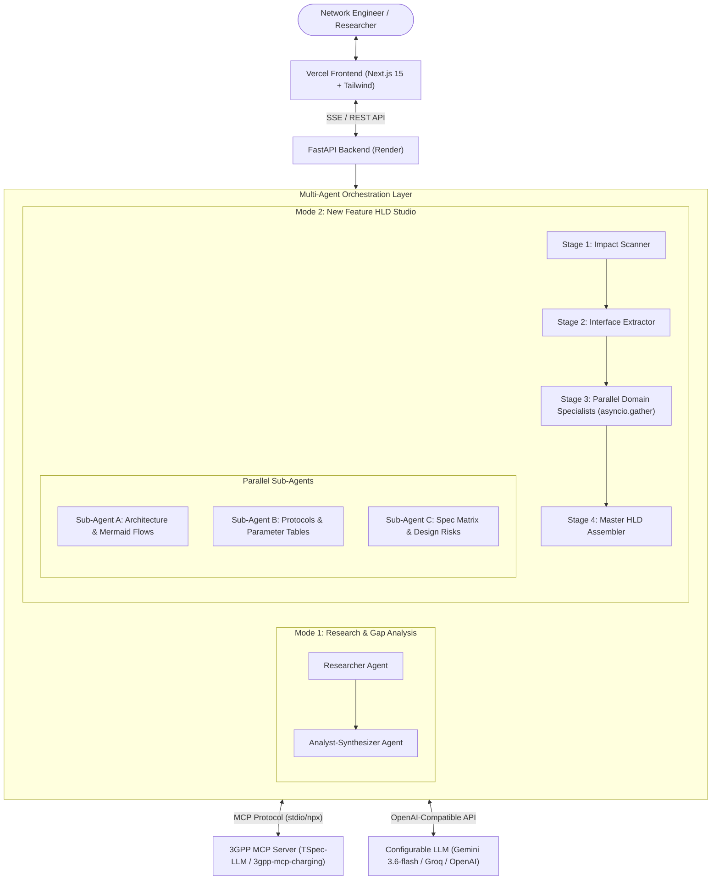

# 3GPP Standards Research & New Feature HLD Studio

An end-to-end, multi-agent AI platform for **3GPP Standards Research, Gap Analysis, and High-Level Design (HLD) Synthesis** powered by Model Context Protocol (MCP) and modern LLMs (Google Gemini, Groq, OpenAI).

---

## 🌟 Key Capabilities

### 1. 💬 Standards Research & Gap Analysis (Mode 1)
* **Multi-Series 3GPP Search**: Broad retrieval across **TS 23** (Core Architecture/5GC/NWDAF), **TS 24** (NAS/Protocols), **TS 29** (SBI APIs), **TS 32** (Charging/CHF), **TS 33** (Security/5G-AKA), **TS 36** (LTE/NB-IoT), and **TS 38** (5G NR RAN).
* **Hybrid Grounding + Domain Synthesis**: Accurately grounds findings on verified 3GPP specifications while enriching reports with deep telecommunications protocol mechanics.
* **Interactive Visualizations**: Renders GitHub-flavored comparison tables and interactive **Mermaid sequence & architecture diagrams** with a click-to-zoom Lightbox modal.

### 2. 🏗️ New Feature High-Level Design (HLD) Studio (Mode 2)
* **3-Stage Divide-and-Conquer Multi-Agent Pipeline**:
  1. **Stage 1 (Impact Scanner)**: Systematically scans and maps affected 3GPP specifications across Stage 1, Stage 2 Architecture, Stage 3 RAN/Core, Security, and OAM.
  2. **Stage 2 (Interface & Parameter Extractor)**: Extracts concrete network interface changes (Uu, Xn, F1, E1, SBI), Information Elements (IEs), timers, and release progression.
  3. **Stage 3 (Parallel Domain Specialists via `asyncio.gather`)**:
     * **Sub-Agent A (Architecture & Signaling)**: Generates Executive Scope, System Architecture, and Mermaid Call Flow diagrams.
     * **Sub-Agent B (Protocols & Interfaces)**: Generates Uu/Xn/F1/SBI parameter tables and Release Evolution Matrices (Rel-15 $\rightarrow$ Rel-19).
     * **Sub-Agent C (Standards & Risks)**: Generates Impacted Spec Matrix tables, hardware/coexistence risks, and LLD Open Questions.
  4. **Stage 4 (Master Document Assembly)**: Assembles the master HLD document ready for 1-click **Markdown Copy** or **`.md` File Download**.
* **1-Click Study Presets**: Built-in templates for *Regenerative Satellite Payloads for NTN*, *On-Demand Network Energy Savings (NES)*, *Ambient IoT & Zero-Energy Devices*, and *URLLC Industrial Ethernet*.

---

## 🏛️ System Architecture



---

## 📁 Repository Structure

```text
├── app/
│   ├── main.py                  # FastAPI entrypoint, SSE streaming, and health endpoints
│   ├── llm.py                   # Multi-provider LLM client with auto-recovery and fallback
│   ├── mcp_client.py            # MCP stdio client wrapper & OpenAI tool definitions
│   ├── prompts.py               # Hybrid & HLD specialist system prompts
│   ├── orchestrator.py          # Sequential and parallel sub-agent pipelines
│   └── agents/
│       ├── base.py              # Tool execution loop with native thought_signature preservation
│       ├── researcher.py        # 3GPP specification research agent
│       ├── analyst.py           # Technical gap analysis & synthesizer agent
│       ├── hld_scanner.py       # Stage 1: Specification impact scanner
│       ├── hld_extractor.py     # Stage 2: Interface & parameter extractor
│       ├── hld_architect.py     # Stage 3: Monolithic HLD architect
│       └── hld_specialists.py   # Stage 3: Parallel domain specialists (Arch, Proto, Risk)
├── frontend/                    # Next.js 15 App Router Frontend
│   ├── src/app/page.tsx         # Dual-mode UI (Research Q&A + HLD Studio)
│   ├── src/components/
│   │   └── Mermaid.tsx          # Client-side Mermaid SVG renderer with Zoom Lightbox Modal
│   ├── package.json
│   └── tailwind.config.ts
├── Dockerfile                   # Multi-runtime Dockerfile (Python 3.11 + Node.js for MCP)
├── .dockerignore
└── requirements.txt             # Backend Python dependencies
```

---

## 🚀 Getting Started

### Prerequisites
* **Python 3.11+**
* **Node.js 18+** (required for `npx 3gpp-mcp-charging@latest`)
* An API key for **Google Gemini**, **Groq**, or **OpenAI**

---

### Local Backend Setup

1. **Clone the repository**:
   ```bash
   git clone https://github.com/your-username/your-repo.git
   cd your-repo
   ```

2. **Set up Python Virtual Environment**:
   ```bash
   python3 -m venv .venv
   source .venv/bin/activate   # Windows: .venv\Scripts\activate
   pip install -r requirements.txt
   ```

3. **Configure Environment Variables (`.env`)**:
   ```env
   # Google Gemini (Recommended - 1M+ context & high TPM)
   LLM_API_KEY="your-gemini-api-key"
   LLM_BASE_URL="https://generativelanguage.googleapis.com/v1beta/openai/"
   LLM_MODEL="gemini-3.6-flash"

   # Or Groq
   # LLM_API_KEY="gsk_..."
   # LLM_BASE_URL="https://api.groq.com/openai/v1"
   # LLM_MODEL="openai/gpt-oss-120b"

   # Optional Hugging Face Token for MCP dataset embeddings
   HUGGINGFACE_TOKEN=""
   ```

4. **Start the FastAPI Backend**:
   ```bash
   uvicorn app.main:app --reload --port 8000
   ```

---

### Local Frontend Setup

1. **Navigate to the frontend directory**:
   ```bash
   cd frontend
   npm install
   ```

2. **Configure `.env.local`**:
   ```env
   NEXT_PUBLIC_BACKEND_URL=http://localhost:8000
   ```

3. **Start Next.js Dev Server**:
   ```bash
   npm run dev
   ```
   Open [http://localhost:3000](http://localhost:3000) in your browser.

---

## 🌐 API Reference

| Method | Endpoint | Description |
| :--- | :--- | :--- |
| `GET` / `HEAD` | `/health` | Health check probe (Render uptime monitor compatible) |
| `POST` | `/chat` | Non-streaming JSON endpoint for Standards Research & Q&A |
| `POST` | `/chat/stream` | Server-Sent Events (SSE) stream with stage events (`status` $\rightarrow$ `evidence` $\rightarrow$ `answer` $\rightarrow$ `done`) |
| `POST` | `/hld` | Non-streaming JSON endpoint for New Feature HLD generation |
| `POST` | `/hld/stream` | SSE stream for 3-Stage HLD Pipeline (`scanner` $\rightarrow$ `extractor` $\rightarrow$ `architect` $\rightarrow$ `hld_document` $\rightarrow$ `done`) |

---

## ☁️ Production Deployment

### 1. Backend on Render (Docker Web Service)
1. Create a new **Web Service** on Render connected to your GitHub repository.
2. Select **Docker** as the runtime (Render will automatically detect the root `Dockerfile`).
3. Add Environment Variables:
   * `LLM_API_KEY`: Your model API key
   * `LLM_BASE_URL`: `https://generativelanguage.googleapis.com/v1beta/openai/`
   * `LLM_MODEL`: `gemini-3.6-flash`
   * `HUGGINGFACE_TOKEN`: *(Optional)*

### 2. Frontend on Vercel
1. Import your GitHub repository into **Vercel**.
2. Set **Root Directory** to `frontend`.
3. Add Environment Variable:
   * `NEXT_PUBLIC_BACKEND_URL`: `https://your-render-backend.onrender.com`
4. Deploy!

---

## 📄 License
Apache-2.0 License.
